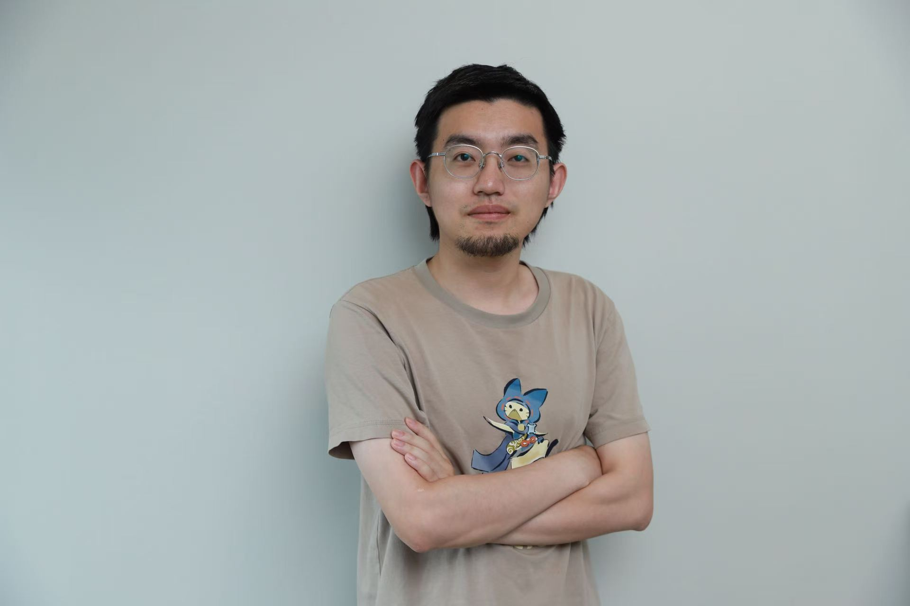

# Current team

## Principal investigator

<a class="person-card person-card--lead person-card--link" href="../members/cancan-yang/" aria-label="View Dr. Cancan Yang's profile">
  
CY

  

    <h3>Dr. Cancan Yang</h3>
    
Associate Professor · Civil Engineering

    
Dr. Yang's research focuses on structural sustainability, adaptive bridge design, bridge life-cycle and risk assessment, and structural applications of 3D concrete printing.

    
She received her B.Sc. from Chongqing University and her M.Sc. and Ph.D. from the University at Buffalo, State University of New York.

    
View profile

  

</a>

## PhD students

Students are listed by program start date.

  <a class="person-card person-card--link" href="../members/rishav-jaiswal/" aria-label="View Rishav Jaiswal's profile">
RJ

<h3>Rishav Jaiswal</h3>
PhD candidate

Joined September 2023

ResearchClimate-resilient highway infrastructure; bridge scour, corrosion, and multi-hazard risk; finite element and machine-learning models.

Beyond researchTo be added by Rishav.

View profile

</a>
  <a class="person-card person-card--link" href="../members/ali-mosaddegh/" aria-label="View Ali Mosaddegh's profile">
AM

<h3>Ali Mosaddegh</h3>
PhD student

Joined September 2023

ResearchPavement engineering; truck platooning and heavy-vehicle loading; pavement damage assessment.

Beyond researchTo be added by Ali.

View profile

</a>
  <a class="person-card person-card--link" href="../members/gaohong-ye/" aria-label="View Gaohong Ye's profile">
GY

<h3>Gaohong Ye</h3>
PhD student

Joined September 2024

ResearchCorrosion and axial behaviour of buried steel piles; soil–structure interaction; field data and design-code assessment.

Beyond researchTo be added by Gaohong.

View profile

</a>
  <a class="person-card person-card--link" href="../members/tianyang-yin/" aria-label="View Tianyang Yin's profile">
<h3>Tianyang Yin</h3>
PhD student

Joined September 2025

ResearchDurability of reinforced-concrete and composite structures under freeze–thaw, fatigue, and extreme loading.

Beyond researchTo be added by Tianyang.

View profile

</a>
  <a class="person-card person-card--link" href="../members/hanzhang-lu/" aria-label="View Hanzhang Lu's profile">
HL

<h3>Hanzhang Lu</h3>
PhD student

Joined January 2026

ResearchTo be added by Hanzhang.

Beyond researchTo be added by Hanzhang.

View profile

</a>
  <a class="person-card person-card--link" href="../members/chushi-cui/" aria-label="View Chushi Cui's profile">
CC

<h3>Chushi Cui</h3>
Incoming PhD student

September 2026

ResearchUltra-high-performance concrete; iron-based shape-memory alloys; self-prestressed reinforcement and strengthening.

Beyond researchTo be added by Chushi.

View profile

</a>
  <a class="person-card person-card--link" href="../members/junhong-qiao/" aria-label="View Junhong Qiao's profile">
JQ

<h3>Junhong Qiao</h3>
Incoming PhD student

September 2026

ResearchIntegral bridge behaviour; fatigue of steel piles; bridge–soil interaction; finite element and parametric analysis.

Beyond researchTo be added by Junhong.

View profile

</a>

## Master's students

  <a class="person-card person-card--link" href="../members/haifaa-s-chutoo/" aria-label="View Haifaa S. Chutoo's profile">
HC

<h3>Haifaa S. Chutoo</h3>
Master's student

Joined September 2025

ResearchTo be confirmed by Haifaa.

Beyond researchTo be added by Haifaa.

View profile

</a>
  <a class="person-card person-card--link" href="../members/zhiyuan-zheng/" aria-label="View Zhiyuan Zheng's profile">
ZZ

<h3>Zhiyuan Zheng</h3>
Incoming master's student

September 2026

ResearchTo be added by Zhiyuan.

Beyond researchTo be added by Zhiyuan.

View profile

</a>

## Co-supervised students

### PhD students

  <a class="person-card person-card--link" href="../members/lillian-wilson/" aria-label="View Lillian Wilson's profile">
LW

<h3>Lillian Wilson</h3>
Co-supervised PhD student

ResearchTo be added by Lillian.

Beyond researchTo be added by Lillian.

View profile

</a>
  <a class="person-card person-card--link" href="../members/raghad-awad/" aria-label="View Raghad Awad's profile">
RA

<h3>Raghad Awad</h3>
Co-supervised PhD student

ResearchTo be added by Raghad.

Beyond researchTo be added by Raghad.

View profile

</a>

### Master's students

  <a class="person-card person-card--link" href="../members/dominic-lasica/" aria-label="View Dominic Lasica's profile">
DL

<h3>Dominic Lasica</h3>
Co-supervised master's student

ResearchTo be added by Dominic.

Beyond researchTo be added by Dominic.

View profile

</a>

Interested in joining the group? See [graduate opportunities and application guidance](../join-us.md).
