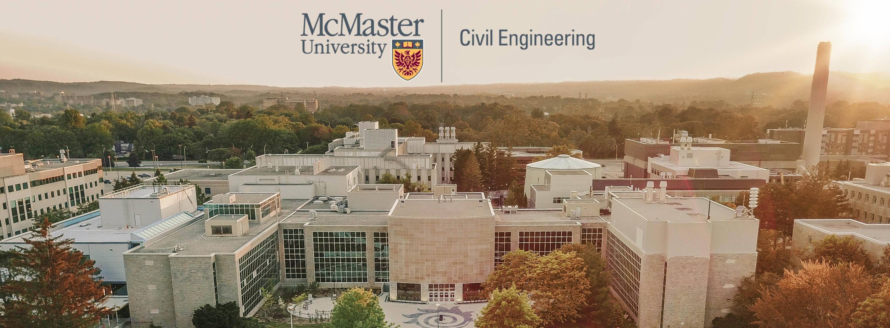

<section class="lab-hero">
  

  

  

    <h1>CAN Lab</h1>
    

      
C创造经久耐用的基础设施。

      
A推进全寿命周期性能。

      
N引领可持续未来。

    

    
基础设施性能 · 耐久性 · 韧性 · 可持续性

    
麦克马斯特大学 · 土木工程系

    

      <a class="lab-button lab-button--primary" href="research/">了解研究方向</a>
      <a class="lab-button" href="join-us/">加入实验室</a>
    

  

</section>

## 面向新一代基础设施的研究

本实验室由麦克马斯特大学土木工程系 **Cancan Yang 副教授**领导，主要研究结构可持续性、桥梁适应性设计、桥梁全寿命风险评估与 3D 混凝土打印。

研究工作结合结构工程、大型结构试验、先进混凝土材料与计算分析。

  <article class="lab-card">01<h3>结构可持续性</h3>
研究基于构件再利用的桥梁与房屋结构设计，提升结构全寿命资源利用效率。

<a href="research/#_1">了解更多 →</a>
</article>
  <article class="lab-card">02<h3>桥梁适应性设计</h3>
面向自动驾驶卡车编队与气候变化开展桥梁适应性研究。

<a href="research/#_2">了解更多 →</a>
</article>
  <article class="lab-card">03<h3>桥梁全寿命性能</h3>
评估极端环境下的结构性能演化、耐久性与风险。

<a href="research/#_3">了解更多 →</a>
</article>

## 最新动态

2024 年 3 月<h3>桥梁安全媒体报道</h3>
巴尔的摩桥梁坍塌事故发生后，Yang 教授就桥梁易损性与结构安全问题接受采访。<a href="https://www.eng.mcmaster.ca/news/in-the-media-local-structural-engineers-debate-whether-the-baltimore-bridge-collapse-could-happen-here/">查看麦克马斯特大学报道 →</a>

2023 年 2 月<h3>分享地震工程专业观点</h3>
麦克马斯特大学土木工程系教师就土耳其和叙利亚地震及震后恢复挑战接受 CTV 与 CHCH 采访。<a href="https://www.eng.mcmaster.ca/civil/news/in-the-media-civil-engineering-associate-professors-share-insights-on-earthquakes/">阅读报道 →</a>

[查看全部新闻](news/index.md) · [认识团队](team/current-members.md) · [浏览论文](publications.md)

!!! info "研究生招生"
    课题组提供全额资助的博士与硕士研究生名额。研究方向、优先考虑的研究背景和联系方式请见[加入我们](join-us.md)页面。
